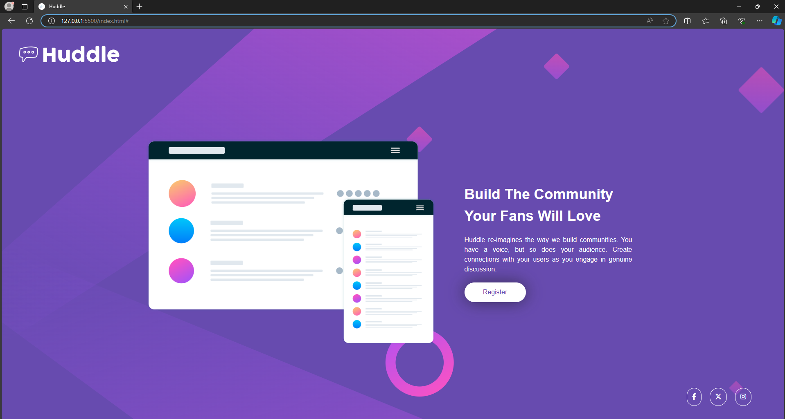

<h1 align="center">Huddle</h1>
 

### 🚨 Sobre o Projeto

O projeto é um desafio do site [Frontend Mentor](https://www.frontendmentor.io/challenges/huddle-landing-page-with-a-single-introductory-section-B_2Wvxgi0), no qual desenvolvi para aprimorar minhas habilidades em HTML e CSS.

### 🔨 Ferramentas Utilizadas

* [HTML](https://developer.mozilla.org/pt-BR/docs/Web/HTML)
* [CSS](https://developer.mozilla.org/pt-BR/docs/Web/CSS)

### 📽️ Projeto 

    </img>

 
 

    </img>
    
Responsividade do Site

